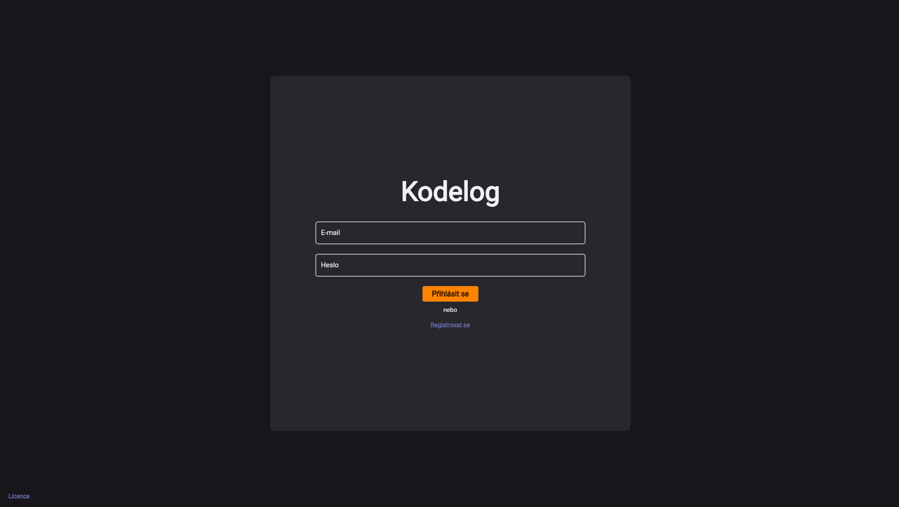
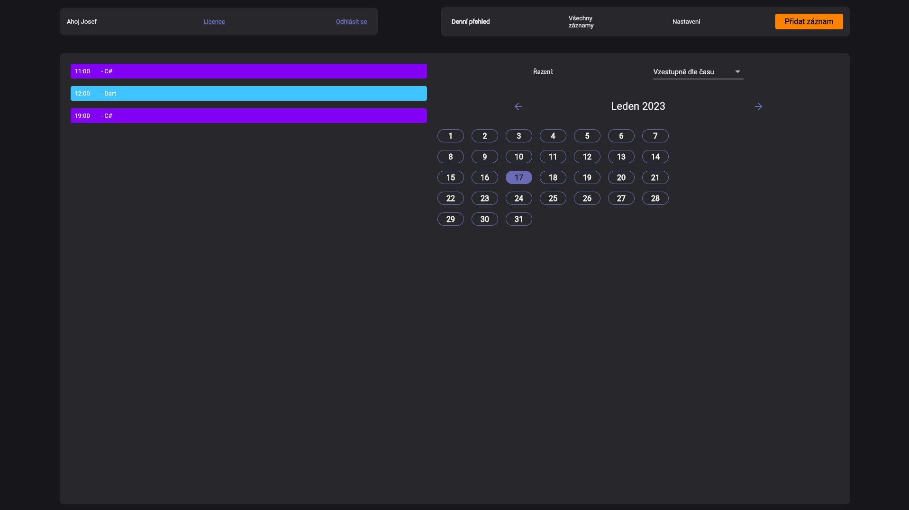
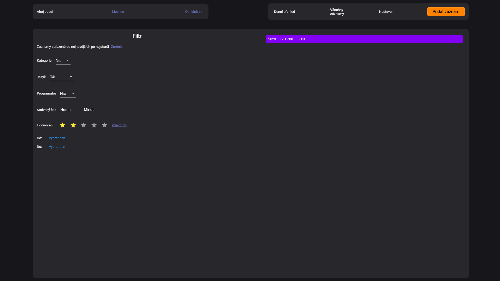
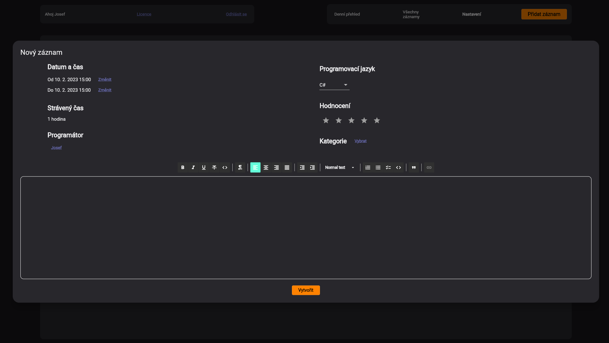

# KodeLog

Deník programátora pro soutěž [Tour de App](https://tourdeapp.cz)

Live verze na https://tourdeapp-70a92.web.app/

Vydáno pod licencí AGPL verze 3
## Tým Royal Buccaneers 
- [Richard Pavlikán](https://richardpavlikan.com) <richardpavlikan [zavináč] gmail.com>
- [Matyáš Caras](https://caras.cafe) <matyas [zavinac caras.cafe]> hernik#9234

## Sestavení
**Před spuštěním/sestavením je nutné zaregistrovat si projekt na Firebase.**
### UNIX
1. `git clone https://github.com/Royal-Buccaneers/kodelog --recursive`
2. `./flutterw build web --release`
### Windows
0. Nainstalovat Flutter
1. Clone
2. Build

## Obrázky (verze 1.x)

